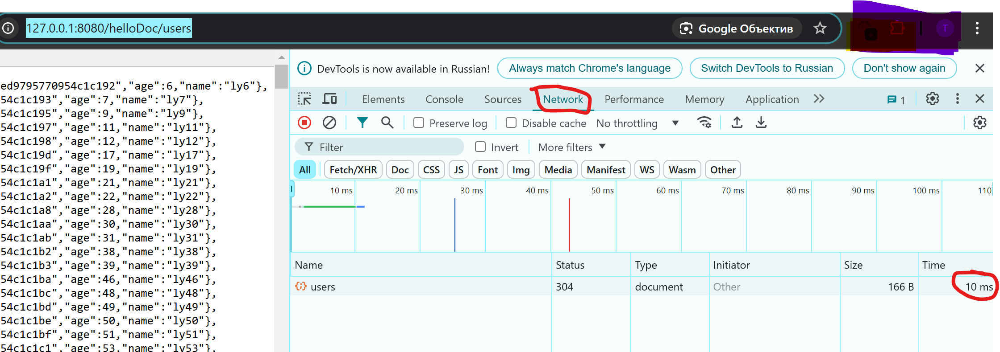

# pymongo-api

## Как запустить

Запускаем mongodb и приложение

```shell
docker compose up -d
```

Заполняем mongodb данными

```shell
./scripts/mongo-init.sh
```

Все инициализации, настройка шардов и заполнение БД находятся внутри этого одного скрипты. Скрипт выполяется 20-30с, так как внутри есть sleep 10, чтобы реплики успели выбрать Primary.

## Как проверить

### Если вы запускаете проект на локальной машине

Откройте в браузере http://localhost:8080

### Если вы запускаете проект на предоставленной виртуальной машине

Узнать белый ip виртуальной машины

```shell
curl --silent http://ifconfig.me
```

Откройте в браузере http://<ip виртуальной машины>:8080

### Проверка работы кеша

Откройте новую вкладку браузера.

Откройте инструменты разработчика, вкладка Network. Я проверял на Chrome.

Скопируйте в адресную строку браузера эндпоинт http://localhost:8080/helloDoc/users.

В колонке Time вкладки Network будет указано время примерно 1-2 сек.


Выполните рефреш страницы с адресом http://localhost:8080/helloDoc/users.

В колонке Time вкладки Network будет указано время <100 мс.

При последующих рефрешах также будет <100 мс.



Для сравнения при проделывании этого теста в проекте mongo-sharding-repl время загрузки всегда остается примерно 1-2 сек.

## Доступные эндпоинты

Список доступных эндпоинтов, swagger http://<ip виртуальной машины>:8080/docs
